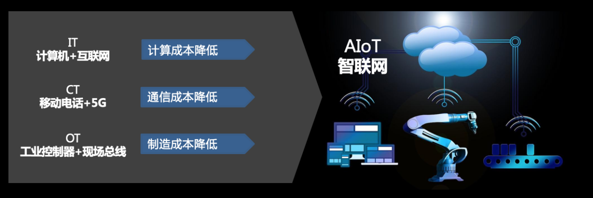
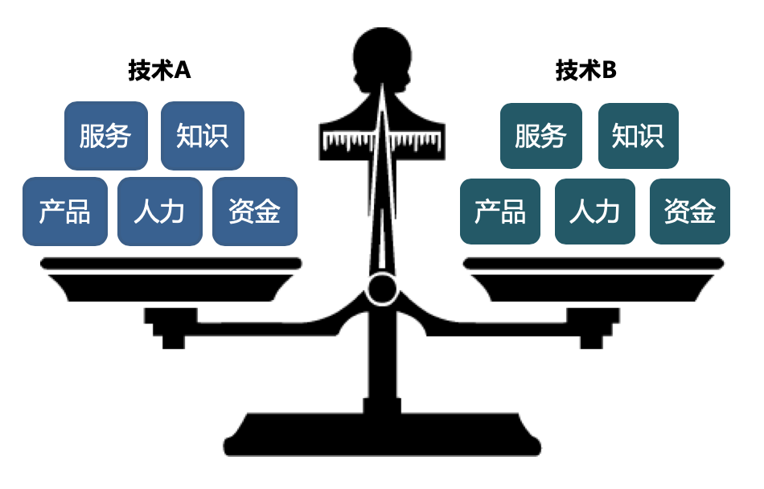
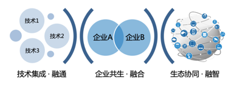

# 第1章 欢迎来到技术的交界点

* 5G重塑互联网的发展
* 工业革命的新进程
* 殊途同归的下半场

世间的万物不是孤立存在的，它们在某种层面都有一定的共性。很多表面上泾渭分明的事物，实则都有相似的内核。本章节，你将会看到，IT领域的计算机、CT领域的移动电话和OT领域的工业控制器，这些“无关”的事物正在按照相似的脉络演进，并即将在智能时代通过某种方式“融合”到一起（见图1-1所示）。

图1-1 IT、CT和OT正在逐步融合

过去，我们将大卫·李嘉图的比较优势理论，运用到国际贸易领域；未来，比较优势理论将渗透到我们生活的方方面面。不同的技术之间、不同的企业之间、不同的生态系统之间，都可以通过比较优势进行各种“能力交易”，跨界融合。那么IT、CT、OT领域的技术有哪些相似？为什么它们不会分道扬镳，而是彼此融合？这些技术应该如何“交易”？这些问题的答案，就藏在计算机、手机和工业控制器的发展历程中。

## 1.1 5G重塑互联网的发展

计算机解决“人的信息”的数字化问题，互联网解决这些信息的互联互通。随着计算机和互联网的发展，人类各种信息处理和计算的成本被极大的降低，很多领域电脑的计算能力优于人脑，互联网将这些信息以极低的成本在全球范围内进行传播。在这个过程中，很多虚拟事物被创造出来，比如游戏、搜索、视频、网络文学…各种各样创新的内容层出不穷。不过现在人们认为计算机与互联网的增长遇到了瓶颈，进入到下半场的阶段。在上半场，“人的信息”已经被极大地激发和创造，有可能会即将遇到天花板。下半场计算机和互联网的主要任务是解决“物的信息”的数字化和互联互通问题，而这也正是5G的目标之一。

随着智能手机的广泛应用，相信大家对2G、3G、4G网络并不陌生。然而什么是2G、3G、4G网络，很多人可能认为只是上网速度有差异。其实，从个人用户的角度来说，上述理解无可厚非。G指的是Generation，也就是“代”的意思。1G到5G的定义，主要是从速率、业务类型、传输时延，还有各种切换成功率角度给出具体实现的技术不同。所以1G就是第一代移动通信系统的意思，2G、3G、4G、5G就分别指第二、三、四、五代移动通信系统，而这也确实是人为划代。要知道，在以前，虽然大家总是言之凿凿地大谈2G，3G，4G，其实这些叫法都只在民间流传的简化叫法，以及商人市场宣传的口号。官方从来不会这么叫，一定要用一串字母才显高端，比如什么GSM，WCDMA，LTE之类的，晦涩难懂，简直太不接地气了，与这一串名称相伴的，是通信界一段混乱不堪的群雄逐鹿编史。

1G通信技术，可谓处于开天辟地的时代，各路大神纷纷登场，百家争鸣，八仙过海，各显神通，通信标准自然也是五花八门。NMT曾在北欧国家、瑞士、荷兰、东欧及俄罗斯使用，AMPS曾在美国及澳洲等地使用，TACS曾经在英国使用，C-450曾在德国、葡萄牙及南非等地使用。除此之外，还有法国的Radiocom 2000、意大利的RTMI、日本的TZ-801等。

其实我们不必在意1G时代这些拗口的缩写到底代表了什么，只需知道这些技术作为曾经开天辟地的先驱，值得我们尊敬。这些先驱为移动通信植入了蜂窝通信的基因，即使到了5G时代也依然在传承。然而，这些标准各自为政没法互通，费用超贵，当时的手机自然是土豪专用，远未飞入寻常百姓家，再加上1G时代的模拟通信也确实在技术上不占优势，于是2G时代很快来临。

2G通信技术在我国1995年被正式开通。有了1G的经验，大家都意识到像1G时代那样混乱的局面行不通，通信还是需要遵守相同的标准，彼此互通对大家都有利，成本也最低。基于这样的共识，欧洲联合起来组成了ETSI（欧洲电信标准协会），搞出来的2G标准叫GSM（全球移动通信系统），这个标准的名字起的确实够大气，事实证明也是如此，后来GSM席卷了全世界，现在还在跟3G和4G共存，果真是生命力顽强。

与此同时，美国高通公司主导的CDMA（码分多址）技术和cdmaOne标准（也简称CDMA），成为2G标准在全球抗衡GSM的最强力量。要说CDMA技术确实是开创性的伟大发明，虽然在2G时代未能取得优势，却将在3G时代大放异彩。作为全球通信技术重要的策源地之一，日本总是独树一帜，他们关起门来搞出了个叫做PDC（个人数字蜂窝电话）的技术。PDC虽然技术上没有GSM和CDMA那么强大，但也算是在日本普及开来了，最高峰时期曾经有近8000万的用户。

从1G时代的百家争鸣，到2G时代的三足鼎立，地球也逐渐变成了“地球村”，各标准组织之间有竞争，但合作与融合逐渐成为了主题。3G通信技术迎来的是一个融合和竞争并存的时代。在全球7个区域标准制定组织合作的基础上，3GPP成立，把制定GSM演进的下一代移动通信标准（也就是3G）作为目标。WCDMA技术由此诞生。那么，另一大2G标准cdmaOne该怎么发展演进到3G呢？高通肯定不允许自己在CDMA技术上的话语权旁落。于是在此需求之上拉起了一帮伙伴，3GPP2组织应运而生，目标就是制定cdmaOne标准到3G的演进，CDMA2000标准也由此诞生。

与此同时，中国在这个阶段迎头赶上了，我们也要做自己主导的通信标准。经过各种努力，最终大家熟知的TD-SCDMA技术被国际电联认定为3G标准，提案也被3GPP接纳。就这样，在3G时代，移动通信标准依然是三足鼎立。WCDMA使用范围相对最广，CDMA2000主要在美国使用，TD-SCDMA主要在中国使用。3G依然是这3种技术的民间统称，并不适合作为某个标准官方名称而存在。

随着人民日益增长的流量需求和网速之间的矛盾不断升级，国际电联说：我们需要下一代通信技术了，并且峰值速率要达到吉比特每秒（1Gbps）！于是3GPP和3GPP2这两个孪生兄弟又都拿出了自己阵营的下一代技术。与此同时，另一个狠角色IEEE（电气电子工程师学会）也加入战局试图分得一杯羹。

因此在4G通信技术的候选名单上，存在3GPP的LTE（Long Term Evolution）、3GPP2的UMB（Ultra Mobile Broadband），还有IEEE的WiMAX（Worldwide Interoperability for Microwave Access），虽然这3种技术的最初版本都还达不到国际电联4G的要求，但并不妨碍它们各自阵营在技术上的激烈角逐。

经过时间的检验，由于业界对UMB技术支持者寥寥，UMB技术率先宣告流产。WiMAX由于自身的缺陷，虽然也有少量的运营商支持，但也难挽颓势。最终，曾经力挺WiMAX的芯片厂家英特尔也被迫放弃WiMAX技术，WiMAX的发展进入死胡同，日渐凋零。时也，势也。LTE此时在通往4G的道路上，已是奔逸绝尘。

5G通信技术终究是来了。不过，在5G的标准化上3GPP一家独大，这次全球高度统一，再也没有其他组织能扛起5G的大旗了，只此一家。因此，关于5G技术的名称，也不用再费劲思考技术化的命名了。再说5G包含了三个主要应用场景，用到的技术很多也不好提炼名称。

在5G之前，从1G到4G全部都是为了服务于“人与人”之间交流和通信的目的而存在。而到了5G，主要是为了服务“物与物”和“人与物”之间的通信需求。也就是说，人类第一次将“物联网”提升到和“人联网”相同的级别，甚至比“人联网”更高的级别。这意味着，人类对通信的认知发生了根本性的变化。通信的目的变了，通信的技术和架构也就随之改变。因此界内人士普遍认为，5G与4G的差异，比得上4G和1G的差异。

## 1.2 工业革命的新进程

与计算机和手机类似，工业界也有自己的“神器”：工业控制器，它就像是一种能够在复杂环境下稳定工作的工业计算机。顾名思义，工业控制器的作用是控制各种生产过程，尽量减少人的操作，让整个制造过程能够有序、高效、优质的开展。 工业控制器主要分为三大类：工业计算机、PLC（可编程逻辑控制器）和单片机（及其高级形态的嵌入式系统）。其中，因为PLC的发明推动了工业自动化的进程，在此我们便以PLC为例，简述工业控制器的发展历程。

1968年的元旦，美国工程师迪克·莫利\(Dick Morley\)绘制了人类历史上第一个工业控制器蓝图。这个还没被命名的东西应有如下特性：没有过程中断、数据进入存储器、坚固的外观、运行稳定，还要有自己独特的编程语言。后来，迪克就和他的朋友创立了莫迪康公司来完成这个构想，PLC随后便诞生了，迪克·莫利也因此被誉为PLC之父。

正是在1968年，为了适应汽车型号不断更新的需求，确保在竞争激烈的汽车工业中占有优势，通用汽车公司提出要研制一种新型的工业控制装置来取代继电器控制装置，为此，通用汽车拟定了10项公开招标的技术要求。通过一番角逐，迪克·莫利发明的PLC凭借编程简单、操作便利、环境适应性强等特点，成功获得了通用汽车的控制器研发项目，开启了PLC正式大规模商用历程。随着应用的普及，PLC一举开创了一个新的时代：工控时代。PLC集软件编程、芯片技术、自动化技术于一体，堪称完美。在工业自动化的世界，还没有哪个单一发明对制造业形成了如此大的影响。

PLC既有单机设备也有联网设备，联网设备需要与工业通信网络搭配使用。这种网络被称为现场总线。现场总线技术的主要功能是将当时的PLC以一种较简洁的方式连接起来，不同的应用需求催生了不同的总线系统，当时自动化公司设计开发总线标准也是行业趋势和时髦的事情。类似于1G时期群雄逐鹿的阶段，为了创造和保护商业利益，各个公司都研发了不同的现场总线通信协议，以便搭配自己公司的PLC使用。

那么，为什么工业现场总线没有被一种协议一统江湖呢？其实国际电工委员会IEC在1985年曾经设想通过委员会来确定一种唯一的标准化的总线系统，来统一工厂和流程自动化的各种网络。但是经过14年的技术和政治斗争，最终失败了。经过来自各个国家、各家公司的代表长达十几年的争论，最终的总线标准繁多，有很多客观原因造成了这一局面：首先，工业现场有各种网络拓扑类型，比如星型、环形、总线型、混合型等。工业现场总线是数字化的通信标准，用于取代模拟信号传输，让更多的信息可以在现场设备和高层的控制系统之间进行双向传输；其次，工业现场需要传输的数据的特点不同。从总线需要传输的数据特点来看，也有许多种，有的数据要求实时性高，有的数据是周期性的，有的则是突发的，有的数据是生产数据，有的数据是管理数据，有的数据是在总线上走隧道…这些差异也决定了不可能用一种总线体系来传输各种不同特点的数据，不同层面的业务需求是不同的，因此需要根据实际的应用场景对相应的总线协议进行优化设计；第三，技术进步和市场需求导致出现新的总线标准，2000年后，由于以太网的发展和控制器对实时性提出更高的要求，许多原来基于串口的总线，改为以太网网络，因此又有了各种基于以太网协议的总线标准，同时由于这段时间无线传感网的技术发展，现场总线也出现了各种无线版本；最后，不同企业和国家要制定自己的现场总线标准，通过标准获利。

工业控制器和现场总线这对组合在过去取得了非凡的成就。它们将生产过程数字化，降低了工人的工作量，同时极大的降低了生产成本。然而随着新一轮工业革命的到来，工业控制器和现场总线遇到了发展瓶颈。在过去的工业时代里，因为生产厂家无法低成本的了解每一个客户的需求，所以往往采用一刀切的方法，就是把多种性能组合到一起，成为一款产品。比如你想要一双适合你的脚的鞋子，鞋厂是无法知道你的脚多大的，所以只能测量很多人的脚之后，把最集中的尺码分成40号、41号、42号等等，但是如果你的脚偏肥或偏瘦，对不起，概不伺候。互联网改变了这个局面，人与人、人与制造商，可以低成本的实现连接，从而让每个人的个性需求被放大，人们越来越喜欢个性化的东西。但是个性化的东西需求量没有那么大，这就需要工业企业能够实现小批量、定制化的快速生产。

随着5G等互联网的发展，工业也将进入智能化时代，各种产品的生产过程需要具备充分的柔性能力，灵活的根据消费者的需求调整制造流程。新一轮的工业智能革命，一方面推进了生产过程中的智能化、数字化进程，另一方面提高了产品从研发、制造、到销售、再到售后的全流程中，各种生产设备、零部件、半成品、成品等的数字化程度。

## 1.3 殊途同归的下半场

计算机和互联网、手机和通信技术、工业控制器和现场总线，每对搭配都是为了解决特定领域的特定问题，本来他们之间并没有太多交集，但是它们如今在各自领域都遇到了增长瓶颈，5G的到来，促使他们进一步融合，进行互联互通的数字化转型，并开拓新蓝海。这个新蓝海目前的叫法是物联网、万物互联或者智联网AIoT（见图1-2所示）。在我的作品《智联网·新思维》中，曾经给出过智联网的定义：

智联网是建立在互联网、大数据、人工智能、物联网等基础之上，是具备智能的连接万事万物的互联网，是智能时代的重要载体和思维方式。智联网通过将物理世界抽象到模型世界，并借此建立完整的数字世界，构筑新型的生产关系。智联网改变旧有思维模式，从而实现人与人、人与物、物与物之间的大规模社会化协作。

图1-2 各种技术殊途同归的下半场智联网AIoT

IT、CT和OT技术，它们之前在各自的领域都可谓所向披靡，但是进入到智联网时代，它们将采用比较优势理论进行融合、协作。比较优势理论是由大卫·李嘉图提出的，这个理论诞生于工业时代前期，最初被用于国际贸易领域，而且从未被颠覆，生命力相当顽强。大卫·李嘉图，他是《政治经济学及赋税原理》一书的作者，这本书被认为是《国富论》后最重要的经济学著作，其中的比较优势理论，也成为自由贸易最强大的理论支持。

什么是比较优势呢？先看看李嘉图版的比较优势。假定英国生产一定数量的毛呢需要100人，葡萄酒需要120人，而葡萄牙生产相同数量的毛呢需要90人，葡萄酒需要80人。注意，无论毛呢还是葡萄酒，葡萄牙都比英国有效率；但相对而言，葡萄牙生产葡萄酒的优势高于毛呢的优势，所以两国最佳方案呢，应该是葡萄牙专心做葡萄酒（生产成本相对于毛呢更低），英国专心产毛呢（生产成本相对于葡萄酒更低），彼此交换导致双赢。比较优势原理的含义是说：在一个社会里面，不论个体是一个人、一个家庭、一个地区，甚至是一个国家，如果他们把有限的资源，包括时间和精力，只用来生产他们的机会成本比较低的那些产品，也就是他们具有比较优势的产品，然后进行交换，这样整个社会产品的总价值能够达到最大，而且每一个个体都能够得到改善，而不论他们的绝对生产能力是高还是低。

这个原理有几个要点：它指的个体可以是个人，可以是家庭，可以是地区，甚至是国家，都适用。它有一个前提条件，那就是每个个体的时间和资源是有限的。这看上去像是个假设，但其实是一个基本的事实。任何人每天他就只有24小时，每个人、每个家庭、每个国家，上天给他的禀赋都是有限的。最重要的是，比较优势不是自己的优势跟别人的优势相比，而是自己跟自己比。自己生产一种产品，自己从事一种活动，所放弃的其他机会。我们拿这种放弃的机会之间进行比较，然后找一个放弃的机会最小的那种。所以，每个人都有自己的比较优势，因为是自己跟自己比，不是自己跟别人比。自己跟别人比，从绝对优势来讲，你可能样样都比别人差，没有绝对优势。但是自己跟自己比，一定会有比较优势。这是比较优势的含义。如果每个个体，都集中生产他们具有比较优势的那种产品，把有限的时间、精力和资源，放在那些放弃的机会最小的，也就是成本最小的那些生产活动上面去，这时候，整个社会总的产量就会达到最大。他们每一个个体的处境，通过交换，都能够得到改善，比较优势的核心不是成本，而是成本比例。比较优势导致分工合作，分工就是合作。

在智联网时代，不同的技术和不同的企业之间，也可以利用比较优势找准自己的定位。这时参与衡量的标准不仅限于设备、产品和人力，还包括各种创意、知识、服务和资金（见图1-3所示）。

图1-3 评价不同技术时需要考虑的重要因素

两项不同的技术，它们所对应的设备、人力、资金、服务、知识有所差异，我们不应该把两种技术进行直接比较，而是应该观察两种技术对于同一种场景的应用落差，创造与每种技术相适应的生存环境，促进技术之间和企业之间的分工协作，从而最大化整个社会的总价值和总效益（见图1-4所示）。

图1-4 比较优势理论的作用

基于比较优势建立的技术针对不同场景和应用之间的相互分工，才有了技术之间更好的进行集成的基础。智联网形成的是一个巨系统，这就要求参与的企业一定要有很强的系统集成能力。如今在实体经济中，一个国际性领先的企业的能力，绝对不在某一项技术上，而是在若干项垂直维度的技术上以及水平维度的集成能力上，比如集成技术、集成产品、集成渠道、集成客户群、集成系统，这样才能成为一个世界性的领先企业。系统集成能力是未来竞争的关键，而系统集成能力一定建立在技术分工的基础之上，分工之后形成技术之间的互相融通。

企业在这种情况下，需要简化成能够综合运用各种技术的“新物种”。无论这些技术是企业自己研发的，还是其他企业提供的，来源并不重要，重要的是将技术充分应用体现价值。这种趋势已经发生，根据市场研究机构IDC对2020年全球情况的分析，已有83%的企业拥有数字化平台，可以轻松访问并且利用其他供应商的技术。

开源技术也是企业值得拥抱的趋势之一，因为开源有助于将企业内部开发或者来自外部的解决方案等多种来源的技术，整合到一个更大的系统当中，将企业打造成一个数字化的创新工厂。同样根据IDC的统计，2019年企业程序库中只有20%的代码来自外部，而到了2025年，企业数字服务中80%的代码将来自外部。

越来越多的企业使用敏捷开发和DevOps（Development和Operations的组合词，这是一组过程、方法与系统的统称，用于促进开发、技术运营和质量保障部门之间的沟通、协作与整合）的方法来创建和管理软件，更多的模块化软件随之产生。到2024年，全球企业将开发和部署超过5.2亿个创新应用和服务，来支持数字经济的发展。

如此多的新应用和新服务，需要企业之间彼此共生、彼此融合，将自身打造成一个“数字化创新工厂”。成功的企业不仅需要提供产品或服务，而且还需要提供创新的动力和能力。有些服务通过企业自己的能力对外提供，有些服务需要通过共生的其他企业背靠背的提供合作，每家企业都依托由此形成的生态系统扩大发展，并在其中找准自己的定位。

目前在智联网领域的玩家，包括来自IT和互联网领域的IBM、通用电气GE、谷歌、微软、亚马逊、思科，也包括来自CT领域的华为、中兴、沃达丰、中国移动、中国联通、中国电信，还包括来自OT领域的西门子、施耐德、ABB、研华科技、罗克韦尔，而且还有各种初创企业，典型的有艾拉物联、涂鸦智能、树根互联、Semtech等，单个企业计划投入资金数以亿美元计甚至十亿或百亿美元计，都对未来踌躇满志，大有一种不达目的不罢休的决心。

由于互联设备的连接数、各种智能技术创新数量、参与企业的数量急剧扩张，智联网的发展到达了临界点，好比滚雪球越滚越快，而且带动的雪花越多。霍尼韦尔公司建筑智能系统部全球总裁曾说，他在这个行业服务了27年，在过去5年，尤其是最近2年看到的技术变革数量比之前25年还要多。而这个由共生企业形成的生态系统之间彼此协同、融合，将构成一个更大的完整生态，这将是一个巨系统，每家企业都是智联网生态中的一员，使用智联网技术，并对外提供智联网产品和服务（见图1-5所示）。

图1-5 智联网时代的技术、企业和生态

智联网作为一个巨系统，很多人可能认为其准入市场的门槛一定很高，如果不是大公司或者手头至少揣着几个亿，就不要去凑热闹。但是事实并非如此，智联网的生态系统具有多样性，初创公司和小微企业同样可以大有可为。关于智联网生态系统的构成，将在本书的后续章节进行详细的介绍。

如今，智联网技术提供商、集成商、服务商的数量激增，已将智联网生态系统逐渐变成一个高度复杂的环境，巨系统已经初具规模。为了应对多种应用的挑战，智联网基础设施通常需要集成跨域硬件和应用系统。同样，它还必须足够灵活，以便有效集成未来不同型号的设备。除了特定行业或应用中的垂直集成之外，数字生态系统的多样性还意味着不同设备和系统之间的横向互操作性也将是智联网成功的关键。

接下来，我们先从各种技术的迭代开始讲起，下一章我将使用通俗易懂的语言，告诉你需要关注的创新技术，以及这些技术的发展情况。

