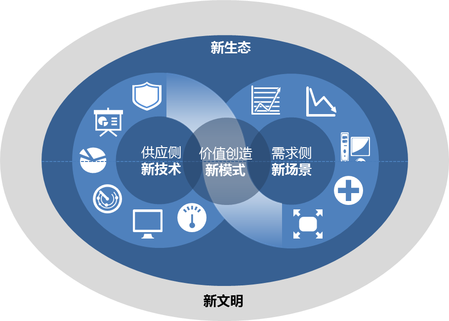

# 序

十四五规划提出，加快数字化发展。发展数字经济，推进数字产业化和产业数字化，推动数字经济和实体经济深度融合，打造具有国际竞争力的数字产业集群。加强数字社会、数字政府建设，提升公共服务、社会治理等数字化智能化水平。

从技术角度讲，大数据、云计算、物联网、区块链、人工智能、5G 通信等新兴技术，都属于数字经济范畴。而5G正在给数字经济带来前所未有的变革，除了运营商之外，来自不同领域的互联网公司、工业企业、初创公司都将搭乘5G这趟高速公路，进行数字化转型。不同领域的技术底蕴和思维方式，在5G的催化剂下，促成各跨界技术、各行业、各企业、各生态的融合、重塑。本书将带你深入浅出地理解与5G相关的各种新技术、新企业和新模式，为你展现出5G对数字经济对巨大推动作用。爱因斯坦曾说：“一切都应该尽可能的简单，但又不能过于简单。”如果近距离地观察5G展开的画布，从供应侧，到价值创造的过程，再到需求侧，都已改变。这些环节之间彼此互相影响，持续进化，进而构造了新的生态圈，这就是数字经济生态（见图0所示）。

图0 数字经济生态

所以，为了更好地理解该生态，我们有必要知道5G从何而来？从而深切感知这种生态为何被称之为“数字经济生态”。

在《李嘉诚全传》一书中，讲述了3G的发展故事。那时，虽然很多人看到3G的确是一个大蛋糕，但是无论挥舞起资金的利刀切下多么大的一块，都不是马上就能吃下肚的，这个蛋糕还需要经过一段时期的发酵才会成熟。这是一段考验人的信心和耐心的时期，而耐心更需要实力的支撑，“超人”李嘉诚也不例外。

3G标准由国际电信联盟（ITU）确定，并在2000年5月确定了WCDMA、CDMA2000以及TD-SCDMA三大主流无线接口标准，写入3G技术指导性文件：《2000年国际移动通讯计划》。日本是全球范围内最早商用3G的国家，早在2001日本运营商NTT就实现3G网络正式商用。日本商用3G的当年，分析师预计2010年，全球的3G收益将达到3220亿美刀。李嘉诚对3G也是极力看好，他的和记黄埔不仅在香港从仅有的四张牌照抢下了一张，还在英国、意大利、瑞典、澳大利亚等国砸重金拿下了珍贵的3G牌照。遗憾的是，此时的3G还没有出现合适的盈利模式。

没有盈利模式，只能烧钱。2003年的3G让李嘉诚吃尽了苦头，那一年的手机商不愿意出3G手机，表示没有应用和设备，做不了；应用商表示没手机供应；设备商则表示，做了也不赚钱，因为消费者根本不买账。这个死循环，让李嘉诚仅在电信业务上就亏损了183亿，相当于每天烧掉5000万港币。当年香港最资深IT分析师之一的徐启棠是3G最早一批的使用者，他认为3G最大的问题是耗电量太快，他对和记黄埔对3G服务幽默地表示：“使用3G需要时刻准备好“3个”备用电池和“3个”充电器。”

2004年3月，李嘉诚公开表示，和记黄埔3G业务的亏损数字将会扩大，主要是因为3G手机销售上升而导致补贴增加，早前定下的2003年年底取得100万名3G客户的目标也未能如期达到。当时野村证券的分析师大胆预测，和黄到2006年将会放弃3G业务。理由很简单：“我们看不到和黄的3G有达到收支平衡的可能。”野村对3G的估值为负630亿元。据估计，和黄每天用于3G上的投资额高达1亿元。在这种局面下，和黄完全可能放弃3G业务。这是一次壮士断腕，只不过，这个腕太大了一些。一时间，3G对于和黄来说成了一个负面的话题。有媒体甚至说，3G似乎已经成为和记黄埔香港公司头顶的一片阴云。

事情到了2008年才逐渐出现起色，那年被称为“手机上网元年”。手机上网必须满足三项条件，缺一不可。一是手机的中央处理器的处理能力要大幅度提高，这个能力从2001年到2008年成长了24倍。二是通信速度要加快，这在8年间成长了375倍。三是屏幕分辨率，也就是画面精细度的提升，也成长了24倍。苹果、谷歌、微软等领导全球IT行业的顶尖企业，都预测这三个条件将在2008年左右成熟，并为此做了充足准备。因此，乔布斯以2008年为目标开发出iPhone手机，绝非偶然。

在我国，工信部在2009年1月7日才向三大运营商发布3G牌照，比日本晚了近8年。整体上来看，尽管3G在2004年就在全球商用，但是其用户增长量以及终端销售量都未达预期。2010年之前，全球手机出货量还是以2G手机为主。2010年第一季度，3G手机销售量首超2G手机，渗透率达到50%。这时距3G在全球首度商用，已经过去了10年。

5G时代，情况则更加复杂，这次它将渗透到“慢车道”，从消费者市场进入企业市场，并持续扩张。但，此时的企业发展却面临一个严峻问题：过去的经验并不适用。因此各种企业纷纷进入“冲浪模式”：如果冲浪者可以顺利冲上浪尖，并停留在那里，他能够冲很长一段时间；但如果他没冲上去，就会被海浪吞没。

中国此前 3G、4G都相对落后，但5G整体进度已经赶上并处于第一梯队。2019年6月6日，工信部正式向中国电信、中国移动、中国联通、中国广电发放5G商用牌照，标志着中国正式进入5G商用元年。

因此，本书将从技术、场景、模式、生态四个角度，解读5G给我们带来的全面、深度的新变革，以及变革过程中产生的疑问：

* 除了CT通信技术，IT信息技术和OT运营技术，为什么会不约而同地走到了一起，在5G时代交汇？（参见第1章）
* 5G是不是伪需求？它引发了哪些新的技术迭代，随之将有哪些新的机遇产生？（参见第2章和第3章）
* 这次由5G引发的技术变革中，一些成功与失败的标准可能被重新定义，它将会如何重塑科技运行的底层逻辑？（参见第4章）
* 5G改变了以消费者为中心的态势，并转移到各类企业、机构等。这种转变将会带来哪些挑战？又会产生哪些价值？（参见第5章）
* 在5G的应用场景中，工业互联网不容小觑。它将如何与5G产生深度融合？（参见第6章）
* 5G的兴起将会如何改变经济增长和商业竞争的法则？（参见第7章）
* 在5G的演进道路中，会诞生哪些有价值的公司？大型企业将会如何重塑发展战略？新生初创企业如何挑战传统巨擘，5G幕后的投资机构起了哪些作用？（参见第8、9章）
* 数字经济的未来会怎样？（参见第10章）

